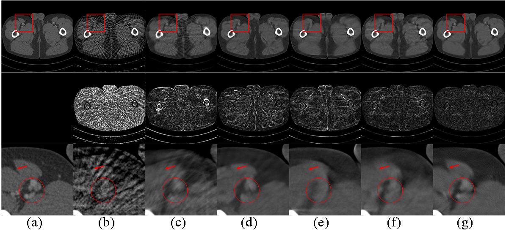

# SWORD

**Paper**: Stage-by-stage Wavelet Optimization Refinement Diffusion Model for Sparse-View CT Reconstruction           

**Authors**: Kai Xu; Shiyu Lu; Bin Huang; Weiwen Wu; Qiegen Liu          
https://ieeexplore.ieee.org/abstract/document/10403850   
IEEE Transactions on Medical Imaging    

The code and the algorithm are for non-comercial use only.
Copyright 2024, School of Information Engineering, Nanchang University.

Diffusion model has emerged as a potential tool to tackle the challenge of sparse-view CT reconstruction, displaying superior performance compared to conventional methods. Nevertheless, these prevailing diffusion models predominantly focus on the sinogram or image domains, which can lead to instability during model training, potentially culminating in convergence towards local minimal solutions. The wavelet transform serves to disentangle image contents and features into distinct frequency-component bands at varying scales, adeptly capturing diverse directional structures. Employing the wavelet transform as a guiding sparsity prior significantly enhances the robustness of diffusion models. In this study, we present an innovative approach named the Stage-by-stage Wavelet Optimization Refinement Diffusion (SWORD) model for sparse-view CT reconstruction. Specifically, we establish a unified mathematical model integrating low-frequency and high-frequency generative models, achieving the solution with an optimization procedure. Furthermore, we perform the low-frequency and high-frequency generative models on wavelet’s decomposed components rather than the original sinogram, ensuring the stability of model training. Our method is rooted in established optimization theory, comprising three distinct stages, including low-frequency generation, high-frequency refinement and domain transform. The experimental results demonstrated that the proposed method outperformed existing state-of-the-art methods both quantitatively and qualitatively.

## The SWORD training process


   
## The pipeline of iterative reconstruction procedure in SWORD


## Reconstruction images from 60 views using different methods.

(a) The reference image, (b) FBP, (c) U-Net, (d) FBPConvNet, (e) patch-based DDPM, (f) GMSD, (g) SWORD. 

## Training
Wavelet-based Full-frequency Diffusion Model (WFDM)
```bash
python main_wavelet.py --config=aapm_sin_ncsnpp_wavelet.py --workdir=exp_wavelet --mode=train --eval_folder=result
```

Wavelet-based High-frequency Diffusion Model (WHDM)
```bash
python main_3h.py --config=aapm_sin_ncsnpp_3h.py --workdir=exp_3h --mode=train --eval_folder=result
```
## Test
```bash
python PCsampling_demo.py
```


## Test Data
In file './Test_CT', 12 sparse-view CT data from AAPM Challenge Data Study.


## Other Related Projects
  * REDAEP: Robust and Enhanced Denoising Autoencoding Prior for Sparse-View CT Reconstruction  
[<font size=5>**[Paper]**</font>](https://ieeexplore.ieee.org/document/9076295)   [<font size=5>**[Code]**</font>](https://github.com/yqx7150/REDAEP)   [<font size=5>**[PPT]**</font>](https://github.com/yqx7150/HGGDP/tree/master/Slide)  [<font size=5>**[数学图像联盟会议交流PPT]**</font>](https://github.com/yqx7150/EDAEPRec/tree/master/Slide)

  * Iterative Reconstruction for Low-Dose CT using Deep Gradient Priors of Generative Model  
[<font size=5>**[Paper]**</font>](https://ieeexplore.ieee.org/abstract/document/9703672)   [<font size=5>**[Code]**</font>](https://github.com/yqx7150/EASEL)   [<font size=5>**[PPT]**</font>](https://github.com/yqx7150/HGGDP/tree/master/Slide)
   
  * Generative Modeling in Sinogram Domain for Sparse-view CT Reconstruction      
[<font size=5>**[Paper]**</font>](https://ieeexplore.ieee.org/document/10233041)   [<font size=5>**[Code]**</font>](https://github.com/yqx7150/GMSD)

  * One Sample Diffusion Model in Projection Domain for Low-Dose CT Imaging  
[<font size=5>**[Paper]**</font>](https://ieeexplore.ieee.org/abstract/document/10506793)   [<font size=5>**[Code]**</font>](https://github.com/yqx7150/OSDM)

  * Wavelet-improved score-based generative model for medical imaging  
[<font size=5>**[Paper]**</font>](https://ieeexplore.ieee.org/abstract/document/10288274)       
       
  * 基于深度能量模型的低剂量CT重建  
[<font size=5>**[Paper]**</font>](http://cttacn.org.cn/cn/article/doi/10.15953/j.ctta.2021.077)   [<font size=5>**[Code]**</font>](https://github.com/yqx7150/EBM-LDCT)  
